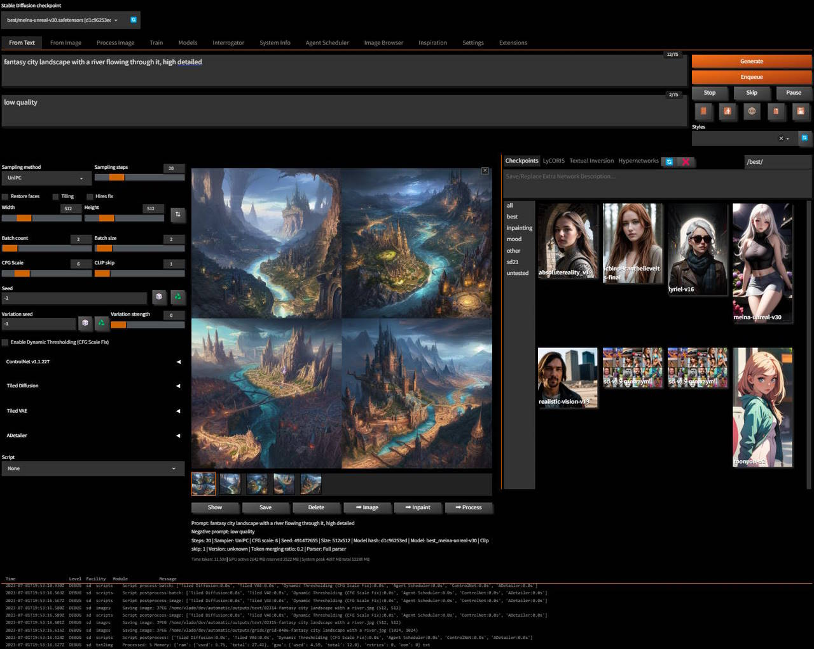

  
# SD.Next
**🫧 Stable Diffusion implementation with modern UI and advanced features 🫧**
   

### [Docs](README.md#docs) | [Discord](https://discord.gg/VjvR2tabEX) | [Changelog](CHANGELOG.md)

This project started as a fork from [Automatic1111 WebUI](https://github.com/AUTOMATIC1111/stable-diffusion-webui/) and it grew significantly since then, but although it diverged considerably, any substantial features to original work is ported to this repository as well.

Individual features are not listed here, instead check [Changelog](CHANGELOG.md) for full list of changes.

## Platform support

- *nVidia* GPUs using **CUDA** libraries on both *Windows and Linux*
- *AMD* GPUs using **ROCm** libraries on *Linux*  
  Support will be extended to *Windows* once AMD releases ROCm for Windows
- Any GPU compatibile with *DirectX* on *Windows* using **DirectML** libraries  
  This includes support for AMD GPUs that are not supported by native ROCm libraries
- *Intel Arc* GPUs using *Intel OneAPI* **Ipex/XPU** libraries  
- *Apple M1/M2* on *OSX* using built-in support in Torch with **MPS** optimizations

## Install

1. Install first:  
**Python** & **Git**  
2. Clone repository  
`git clone https://github.com/vladmandic/automatic`
3. Run launcher  
  `webui.bat` or `webui.sh`:  
    - Platform specific wrapper scripts For Windows, Linux and OSX  
    - Starts `sdnext.py` in a Python virtual environment (`venv`)  
    - Uses `install.py` to handle all actual requirements and dependencies

> Server can run without virtual environment, but it is recommended to use it to avoid library version conflicts with other applications  

> **nVidia/CUDA** and **AMD/ROCm** are auto-detected is present and available, but for any other use case specify required parameter explicitly or wrong packages may be installed as installer will assume CPU-only environment.

Full startup sequence is logged in `sdnext.log`, so if you encounter any issues, please check it first.

Below is partial list of all available parameters, run `webui --help` for the full list:

    Setup options:
      --use-ipex                       Use Intel OneAPI XPU backend, default: False
      --use-directml                   Use DirectML if no compatible GPU is detected, default: False
      --use-cuda                       Force use nVidia CUDA backend, default: False
      --use-rocm                       Force use AMD ROCm backend, default: False
      --skip-update                    Skip update of extensions and submodules, default: False
      --skip-requirements              Skips checking and installing requirements, default: False
      --skip-extensions                Skips running individual extension installers, default: False
      --skip-git                       Skips running all GIT operations, default: False
      --skip-torch                     Skips running Torch checks, default: False
      --reinstall                      Force reinstallation of all requirements, default: False
      --debug                          Run installer with debug logging, default: False
      --reset                          Reset main repository to latest version, default: False
      --upgrade                        Upgrade main repository to latest version, default: False
      --safe                           Run in safe mode with no user extensions

  

## Notes

### **Collab**

- To avoid having this repo rely just on me, I'd love to have additional maintainers with full admin rights. If you're interested, ping me!  
- In addition to general cross-platform code, desire is to have a lead for each of the main platforms.
This should be fully cross-platform, but I would really love to have additional contibutors and/or maintainers to join and help lead the efforts on different platforms.

### **Goals**

The idea behind the fork is to enable latest technologies and advances in text-to-image generation.

> *Sometimes this is not the same as "as simple as possible to use".*

If you are looking an amazing simple-to-use Stable Diffusion tool, I'd suggest [InvokeAI](https://invoke-ai.github.io/InvokeAI/) specifically due to its automated installer and ease of use.  

General goals:

- Cross-platform
  - Create uniform experience while automatically managing any platform specific differences
- Performance
  - Enable best possible performance on all platforms
- Ease-of-Use
  - Automatically handle all requirements, dependencies, flags regardless of platform
  - Integrate all best options for uniform out-of-the-box experience without the need to tweak anything manually
- Look-and-Feel
  - Create modern, intuitive and clean UI
- Up-to-Date
  - Keep code up to date with latest advanced in text-to-image generation

## Credits

- Main credit goes to [Automatic1111 WebUI](https://github.com/AUTOMATIC1111/stable-diffusion-webui)
- Additional credits are listed in [Credits](https://github.com/AUTOMATIC1111/stable-diffusion-webui/#credits)
- Licenses for modules are listed in [Licenses](html/licenses.html)

### **Docs**

- [Wiki](https://github.com/vladmandic/automatic/wiki)
- [ReadMe](README.md)
- [ToDo](TODO.md)  
- [Changelog](CHANGELOG.md)
- [CLI Tools](cli/README.md)

 
