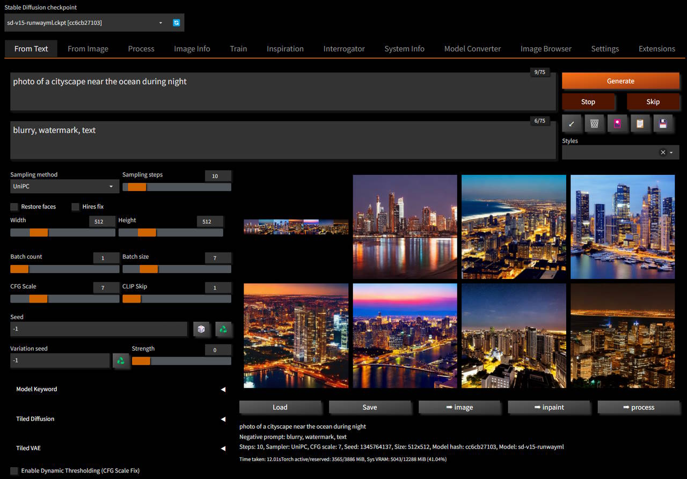

# Stable Diffusion - Automatic

*Heavily opinionated custom fork of* <https://github.com/AUTOMATIC1111/stable-diffusion-webui>  

Fork is as close as up-to-date with origin as time allows  
All code changes are merged upstream whenever possible  

The idea behind the fork is to enable latest technologies and advances in text-to-image generation  
*Sometimes this is not the same as "as simple as possible to use"*  
If you are looking an amazing simple-to-use Stable Diffusion tool, I'd suggest [InvokeAI](https://invoke-ai.github.io/InvokeAI/) specifically due to its automated installer and ease of use  

 

 

## Notes

### Fork does differ in few things

- New logger
- New error and exception handlers  
- Built-in performance profiler
- Updated **Python** libraries to latest known compatible versions  
  e.g. `accelerate`, `transformers`, `numpy`, etc.  
- Includes opinionated **System** and **Options** configuration  
  e.g. `samplers`, `upscalers`, etc.  
- Does not rely on `Accelerate` as it only affects distributed systems  
- Optimized startup  
  Gradio web server will be initialized much earlier which model load is done in the background  
  Faster model loading plus ability to fallback on corrupt models  
- Uses simplified folder structure  
  e.g. `/train`, `/outputs/*`, `/models/*`, etc.  
- Enhanced training templates  
- Built-in `LoRA`, `LyCORIS`, `Custom Diffusion`, `Dreambooth` training  

### User Interface

- Includes updated **UI**: reskinned and reorganized  
  Black and orange dark theme with fixed width options panels and larger previews  

### Optimizations

- Optimized for `Torch` 2.0  
- Runs with `SDP` memory attention enabled by default if supported by system  

### Removed

- Drops compatibility with older versions of `python` and requires **3.9**  
- Drops localizations  
- Drops automated tests  

### Integrated CLI/API tools

Fork adds extra functionality:

- New skin and UI layout  
- Ships with set of **CLI** tools that rely on *SD API* for execution:  
  e.g. `generate`, `train`, `bench`, etc.  
  [Full list](<cli/>)

### Integrated Extensions

- [System Info](https://github.com/vladmandic/sd-extension-system-info)
- [ControlNet](https://github.com/Mikubill/sd-webui-controlnet)
- [Image Browser](https://github.com/AlUlkesh/stable-diffusion-webui-images-browser)
- [LORA](https://github.com/kohya-ss/sd-scripts) *(both training and inference)*
- [LyCORIS](https://github.com/KohakuBlueleaf/LyCORIS) *(both training and inference)*
- [Model Converter](https://github.com/Akegarasu/sd-webui-model-converter)
- [CLiP Interrogator](https://github.com/pharmapsychotic/clip-interrogator-ext)
- [Dynamic Thresholding](https://github.com/mcmonkeyprojects/sd-dynamic-thresholding)
- [Steps Animation](https://github.com/vladmandic/sd-extension-steps-animation)
- [Seed Travel](https://github.com/yownas/seed_travel)

 

## Install

1. Install first:  
`Python`, `Git`  
2. Clone repository  
`git clone https://github.com/vladmandic/automatic`

## Run

Run desired startup script to install dependencies and extensions and start server:

- `webui.bat` and `webui.sh`:  
  Platform specific wrapper scripts that starts `launch.py` in Python virtual environment  
  *Note*: Server can run without virtual environment, but it is recommended to use it  
  **If you're unsure which launcher to use, this is the one you want**  
- `launch.py`:  
  Main startup script  
  Can be used directly to start server in manually activated `venv` or to run it without `venv`  
  Run `python launch.py --help` for available options  
- `setup.py`:  
  Main installer, used by `launch.py`  
  Can also be used directly to update repository or extensions  
  If running manually, make sure to activate `venv` first (if used)  
  Run `python setup.py --help` for available options  
  Setup details are logged to `setup.log`  
- `webui.py`:  
  Main server script  
  Run `python webui.py --help` for available options  

 

## Other

### Scripts

This repository comes with a large collection of scripts that can be used to process inputs, train, generate, and benchmark models  
As well as number of auxiliary scripts that do not rely on **WebUI**, but can be used for end-to-end solutions such as extract frames from videos, etc.  
For full details see [Docs](cli/README.md)

 

### Docs

- Scripts are in [Scripts](cli/README.md)  
- Everything else is in [Wiki](https://github.com/vladmandic/automatic/wiki)  
- Except my current [TODO](TODO.md)  

 
